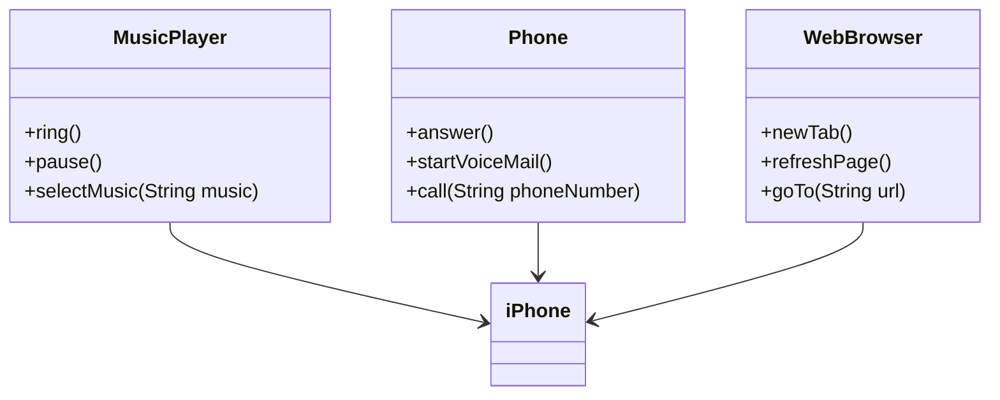

# UML Class Diagram - Made with [Mermaid](https://mermaid.js.org/)

```mermaid
classDiagram
    class MusicPlayer {
        +ring()
        +pause()
        +selectMusic(String music)
    }

    class Phone {
        +answer()
        +startVoiceMail()
        +call(String phoneNumber)
    }

    class WebBrowser {
        +newTab()
        +refreshPage()
        +goTo(String url)
    }

    class iPhone {
    }

    MusicPlayer --> iPhone
    Phone --> iPhone
    WebBrowser --> iPhone
```
